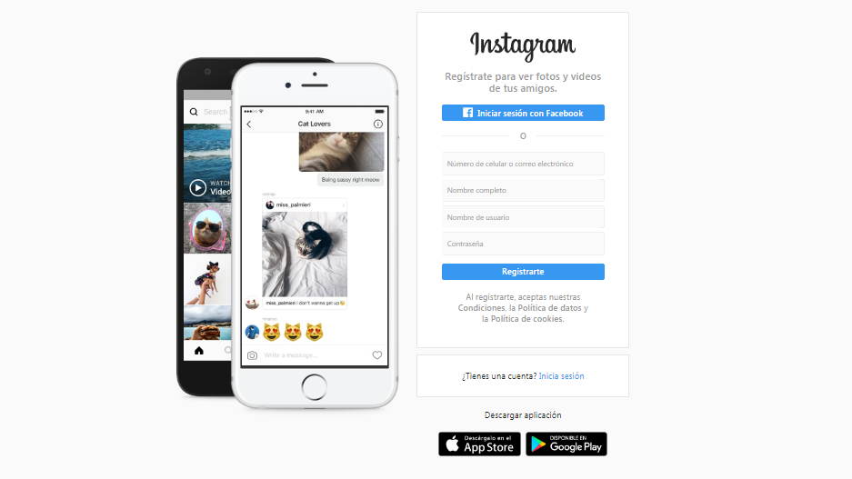
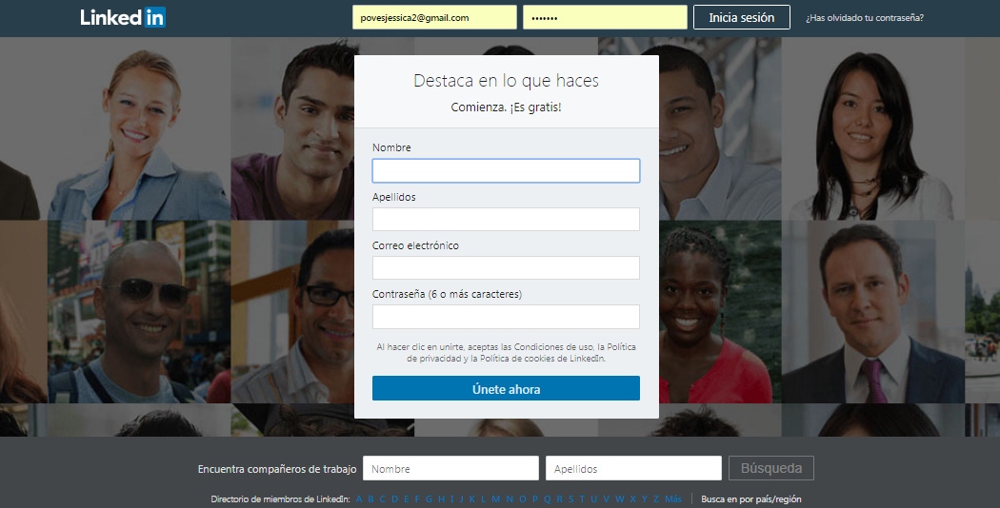
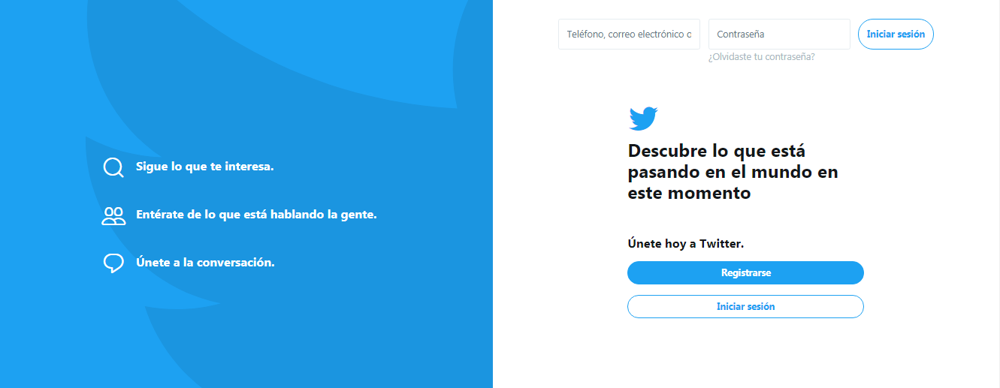
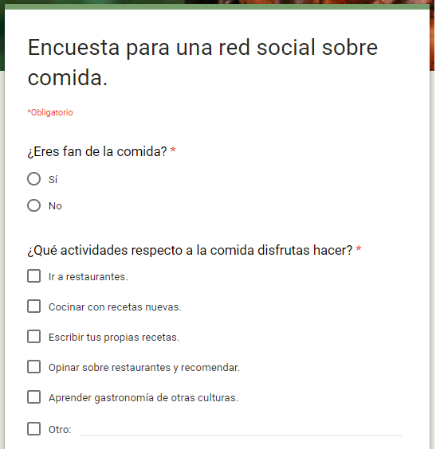
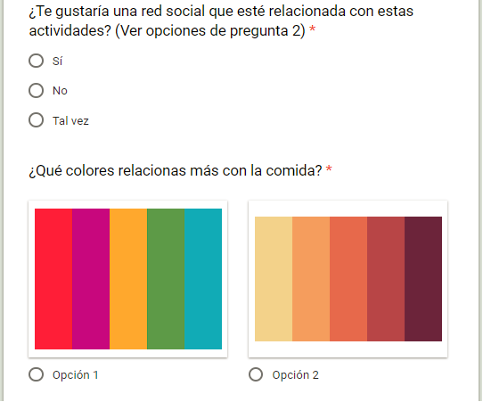
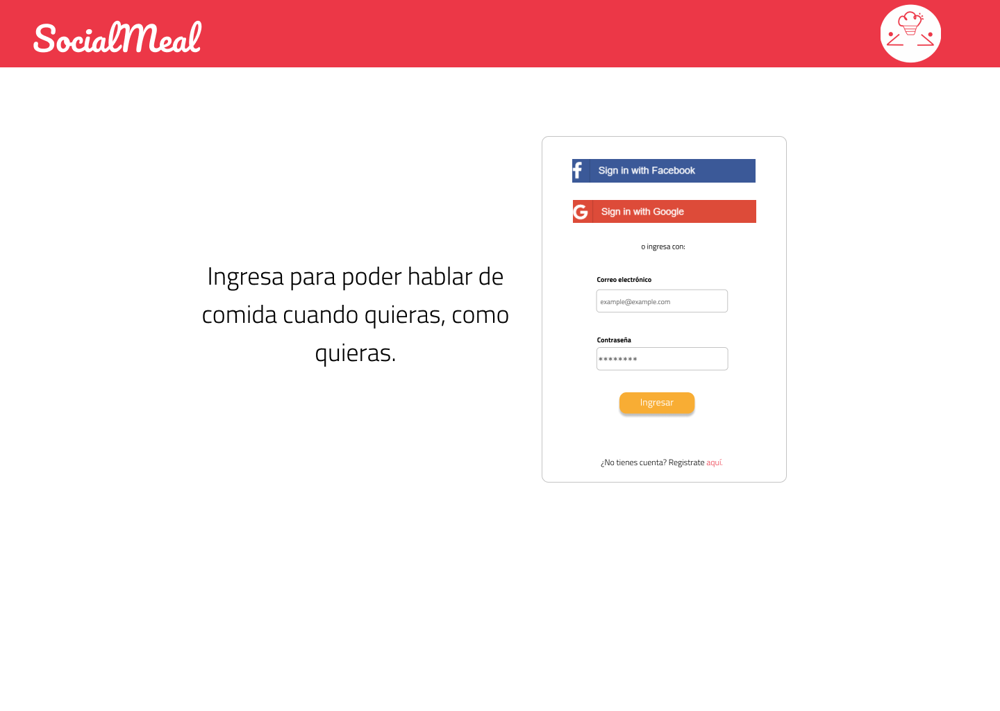

# Creando una Red Social

## Preámbulo

Instagram, Snapchat, Twitter, Facebook, Twitch, Linkedin, etc. Las redes
sociales han invadido nuestras vidas. Las amamos u odiamos, y muchxs no podemos
vivir sin ellas.

Hay redes sociales de todo tipo y para todo tipo de intereses. Por ejemplo,
en una ronda de financiamiento con inversionistas, se presentó una red social
para químicos en la que los usuarios podían publicar artículos sobre sus
investigaciones, comentar en los artículos de sus colegas, y filtrar artículos
de acuerdo a determinadas etiquetas o su popularidad, lo más reciente, o lo
más comentado.

## Introducción

Una emprendedora nos ha encargado crear una red social. No nos da mucho detalle
sobre qué tipo de red social quiere, sólo nos dice que creemos la mejor que
podamos, y que luego la convenzamos de lanzarla al mercado. Nos da ciertos temas
en los que le gustaría invertir:

* Alimentación
* Feminismo
* Educación
* Salud
* Energías Renovables

#### 1) Definición del producto

* Los elementos básicos que tiene una red social.

   Tienen como finalidad principal poner en contacto a personas.

   Permiten la interacción entre todos los usuarios de la plataforma.

   Fomentan la difusión viral de la red social a través de cada uno de los usuarios que la componen

* Benchmarks de las principales redes sociales:

[benchmark-facebook](https://subefotos.com/ver/?0e808f9fa2d54bdfe0672f81773ee76eo.png)

[benchmark-instagram](https://subefotos.com/ver/?b2942392b247ecb39ff07133d2c61538o.png)

[benchmark-linkedin](https://subefotos.com/ver/?7faad39899152f2ce05ce270b04345f4o.png)

[benchmark-twitter](https://subefotos.com/ver/?8c8cda0f58061d6ec04737a477684ea2o.png)

* Nuestro producto esta orientado al tema de la Alimentaciòn visto desde un modo de compartir conocimiento y experiencias culinarias.

* Los principales usuarios de  nuestro producto es el público en general interesado en la comida.

* Descubrimos las necesidades de los usuarios mediante una encuesta , utilizamosla herramienta [Google.docs](https://docs.google.com/forms). Adjuntamos la encuesta realizada.

+

* La necesidad que cubre nuestro producto para estos usuarios son dos (Aprender a cocinar con nuevas recetas de culturas diversas, compartir experiencias de visitas a restaurantes así como dejarse influenciar por las recomendaciones de otros.)
 
 * Los objetivos de estos usuarios en relación con el producto es el compartir experiencias culinarias.

* Las principales funcionalidades del producto y cuál es su prioridad.
* Cómo verificaste que el producto les está resolviendo sus problemas.
* Cómo te asegurarás que estos usuarios usen este producto.

Para poder llegar a estas definiciones te recomendamos revisar: benchmarks, entrevistas con usuarios y tests de usabilidad.

#### 2) Diseño de la Interfaz de Usuario 

* Prototipo de baja fidelidad

[Prototipo-bajaFidelidad](https://subefotos.com/ver/?58c7632fd64b545258cc3bee0b9a9ae0o.jpg)

* Prototipo de alta fidelidad

[Prototipo-altaFidelidad](https://www.figma.com/file/HFYVGtOPIWHAFI0MoAwe0Aiu/Registro-SocialMeal-mobile)

[Colores y tipografía]
(https://drive.google.com/drive/my-drive?ogsrc=32)

#### 3) Implementación de la Interfaz de Usuario

[Página web de nuestra red social "SOCIALMEALS"](https://fiorellasaro.github.io/lim-2018-05-bc-core-am-socialnetwork/src/)

